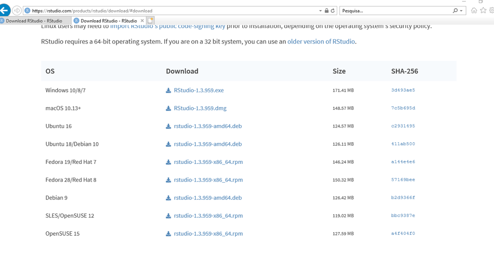
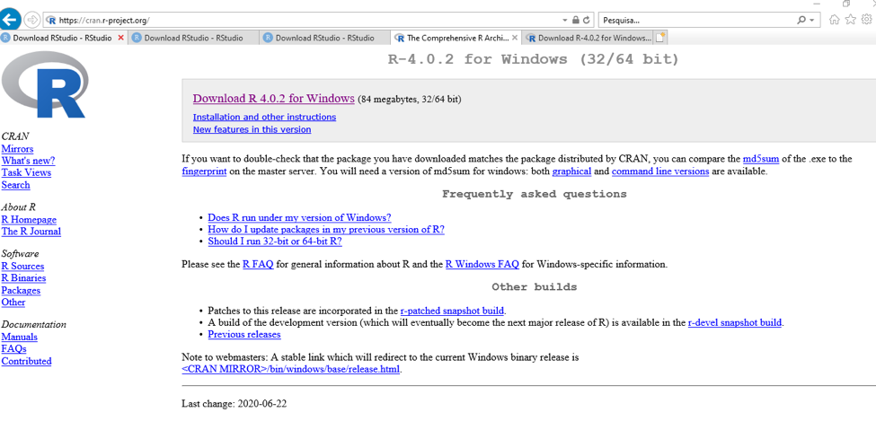
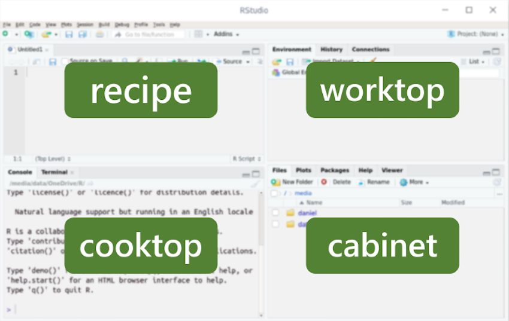

# Instalando o R e o RStudio
 
Para trabalhar com R, é necessário instalar dois softwares: R-base e RStudio. Para utilizar o RStudio, é necessário primeiro instalar o R-base.

Siga os passos para instalação de acordo com o sistema operacional do seu computador.

## LINUX

### Instalar o R

* Passo 1: Abra o terminal. Se utilizar distribuição Fedora, pressione as teclas Super + T, e no Ubuntu Ctrl + Alt + t;  
* Passo 2: Com o terminal aberto digite a seguinte linha de comando:
  + Fedora: `sudo dnf install R`
  + Ubuntu: `sudo apt-get install r-base r-base-core`  
* Passo 3: Pressione a tecla Enter para confirmar;     
* Passo 4: Digite a senha do usuário;   
* Passo 5: Clique em Confirmar. Pronto! O R estará instalado e pode ser acessado.

Link para eventual consulta: [http://cran-r.c3sl.ufpr.br/bin/linux/](http://cran-r.c3sl.ufpr.br/bin/linux/)

### Instalar o RStudio

* Passo 1: Acesse o site [https://rstudio.com/products/rstudio/download/](https://rstudio.com/products/rstudio/download/)  
* Passo 2: Encontre na página o local de download gratuito conforme figura abaixo:

```{r img1, echo=FALSE}

```

* Passo 3: Encontre o sistema operacional do seu computador (Ubuntu, Fedora, Debian ou OpenSUSE) e faça download.  
* Passo 4: Acesse o terminal na pasta onde foi feito o download e siga as instruções abaixo usando Fedora ou Ubuntu:  
  + Fedora: `sudo dnf install nomedo_arquivo_baixado.rpm`; Ex: `sudo dnf install rstudio-1.3.959-x86_64.rpm` 
  + Ubuntu: `sudo dpkg -i nomedo_arquivo_baixado.deb`  
* Passo 5: O RStudio está instalado e pronto para uso!

## Mac OS X

### Instalar o R

* Passo 1: Abra o site [CRAN - https://cran.r-project.org/](https://cran.r-project.org/)
* Passo 2: Clique em "Download de R for (Mac) OS X".   
* Passo 3: Clique duas vezes no arquivo depois de baixado. Pronto! O R está instalado.

### Instalar o RStudio

* Passo 1: Acesse o site [https://rstudio.com/products/rstudio/download/](https://rstudio.com/products/rstudio/download/)    
* Passo 2: Encontre na página o local de download gratuito conforme figura abaixo:  
  
```{r img2, echo=FALSE}

```

* Passo 3: Encontre o sistema operacional do seu computador (Mac OS) e faça download.  
* Passo 4: Depois de baixado, clique duas vezes no arquivo para instalá-lo. O RStudio está instalado e pronto para uso! 

## Windows  

### Instalar o R

* Passo 1: Clique no seguinte link [https://cran.r-project.org/bin/windows/base/]( https://cran.r-project.org/bin/windows/base/)   
* Passo 2: Clique em Download R for Windows (os números que aparecem nesse arquivo de download correspondem à versão do R disponível):

```{r img3, echo=FALSE}

```

* Passo 3: Clique duas vezes no arquivo depois de baixado. Clique em Avançar até finalizar a instalação. Pronto! O R está instalado.

### Instalar o RStudio

* Passo 1: Acesse o site [https://rstudio.com/products/rstudio/download/](https://rstudio.com/products/rstudio/download/)  
* Passo 2: Encontre na página o local de download gratuito conforme figura abaixo:

```{r img4, echo=FALSE}

```

* Passo 3: Encontre o sistema operacional do seu computador (Windows) e faça download.
* Passo 4: Depois de baixado, clique duas vezes no arquivo para instalá-lo. O RStudio está instalado e pronto para uso!

## Identificando o RStudio

O RStudio tem quatro interfaces, espaços distribuídos na sua tela, fáceis de identificar e de trabalhar.

São elas:

* Source: local onde são inseridos os códigos-fonte. Fica no canto superior esquerdo.
* Console: também chamado de terminal, onde são mostrados os resultados dos comandos executados pelos códigos na Source. Fica no canto inferior esquerdo.
* Environment: também chamado de ambiente, onde são mostrados os elementos (por exemplo, vetores, bases de dados etc) que foram criados. Fica no canto superior direito.
* Viewer: também chamado files, onde são mostrados os arquivos, pacotes, pastas, entre outros. Fica no canto inferior direito.

```{r cozinha, echo=FALSE}

```


## Criando um projeto no RStudio

Uma forma prática de iniciar o trabalho com o RStudio é criando projetos.

Para iniciar um novo projeto:

* Acesse o menu "File > New Project", ou 
* então o ícone  na parte superior direita do RStudio. 

O RStudio vai perguntar se você quer criar um novo diretório para o projeto, usar um diretório existente, ou ainda clonar um repositório distante (GitHub, por exemplo). 

Para criar um novo diretório:

* Clique em “New Directory”, escolha entre as opções de tipos de projeto oferecidas e dê um nome ao seu novo diretório.

Ali, você poderá salvar todos os documentos do projeto.

Ao fechar o RStudio, todos os documentos e os objetos do ambiente serão salvos no projeto, e você pode retomar o trabalho de onde parou quando quiser.

Lembre-se: as bibliotecas devem ser recarregadas cada vez que você iniciar uma seção do R.
